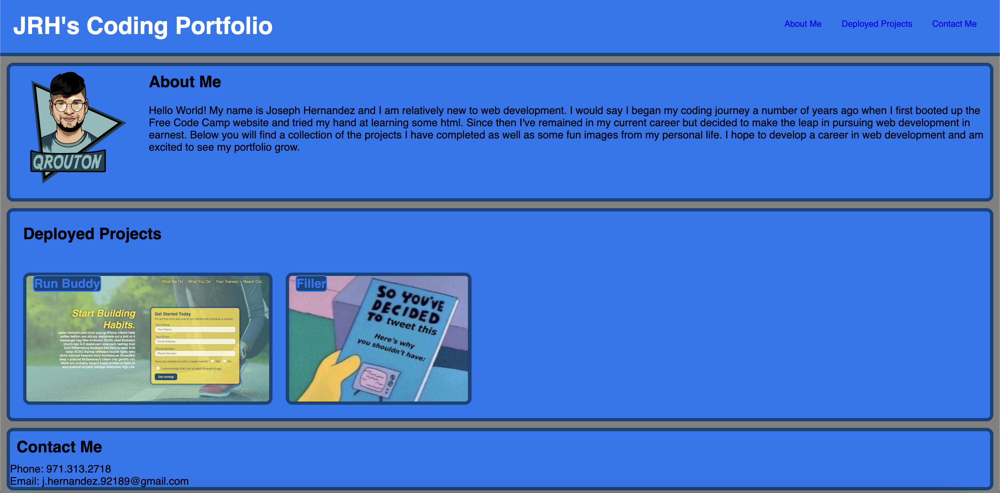

# JRHsCodingPortfolio

This weeks project was to develop a professional portfolio that will be built upon throughout the coding bootcamp. 
This is the first project in which we are having to start our code from scratch and WOW was it difficult. Utilizing everything
we had learned about HTML and CSS and primarily flexbox, I was able to get the layout more or less to my liking.
Utilizing media queries to change the format of the page depending on what screensize was used to view presented some
difficulties however once again I was able to get it to look the way I had envisioned on my wireframe. I enjoyed
the challenge however, and whilst my project may be very rudimentary, I believe I was able to tick all the boxes
required for project completion. 

The requirements were as follows:

GIVEN I need to sample a potential employee's previous work
WHEN I load their portfolio
THEN I am presented with the developer's name, a recent photo or avatar, and links to sections about them, their work, and how to contact them
WHEN I click one of the links in the navigation
THEN the UI scrolls to the corresponding section
WHEN I click on the link to the section about their work
THEN the UI scrolls to a section with titled images of the developer's applications
WHEN I am presented with the developer's first application
THEN that application's image should be larger in size than the others
WHEN I click on the images of the applications
THEN I am taken to that deployed application
WHEN I resize the page or view the site on various screens and devices
THEN I am presented with a responsive layout that adapts to my viewport

https://jrhscoding.github.io/JRHsCodingPortfolio/

https://github.com/jrhscoding/JRHsCodingPortfolio

